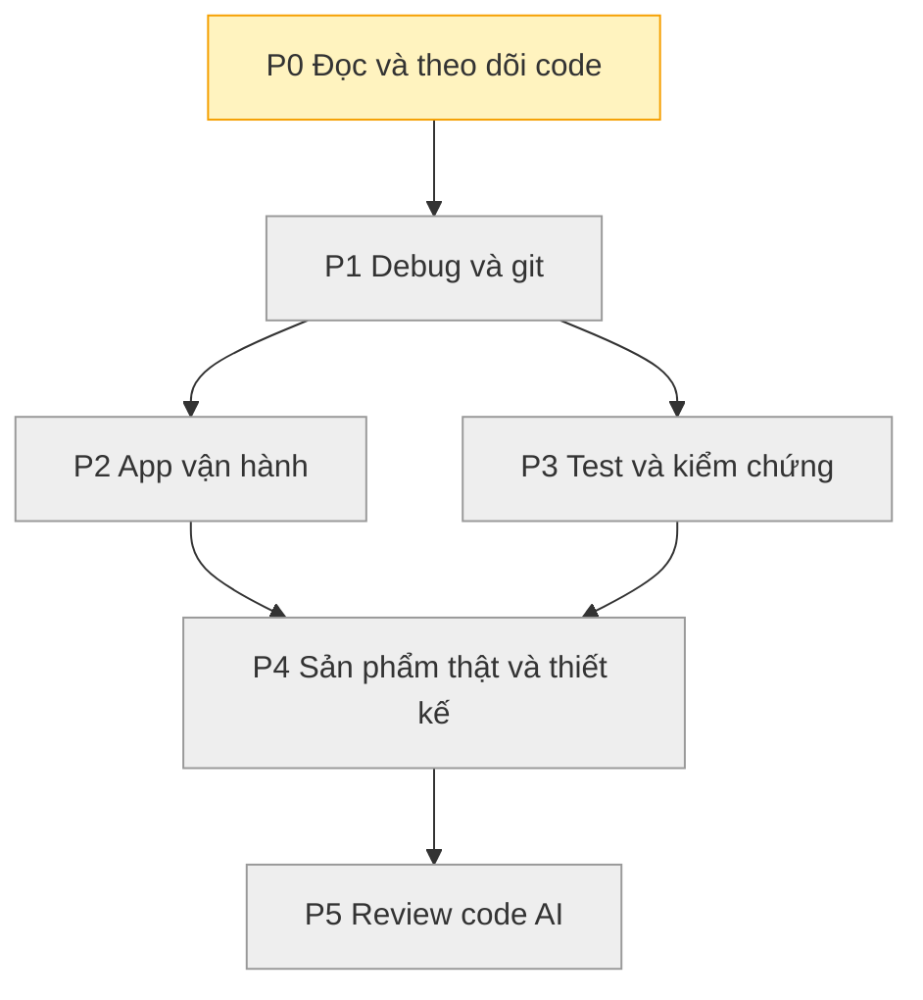

# Sơ đồ tiến độ

Xanh = xong, vàng = đang làm, xám = chưa. Cập nhật `:::` khi ROADMAP.md đổi trạng thái.

```mermaid
flowchart TD
  P0[P0 Đọc và theo dõi code]:::doing --> P1[P1 Debug và git]:::todo
  P1 --> P2[P2 App vận hành]:::todo
  P1 --> P3[P3 Test và kiểm chứng]:::todo
  P2 --> P4[P4 Sản phẩm thật và thiết kế]:::todo
  P3 --> P4
  P4 --> P5[P5 Review code AI]:::todo
  classDef done fill:#c8e6c9,stroke:#2e7d32
  classDef doing fill:#fff3bf,stroke:#f59f00
  classDef todo fill:#eeeeee,stroke:#999999
```
